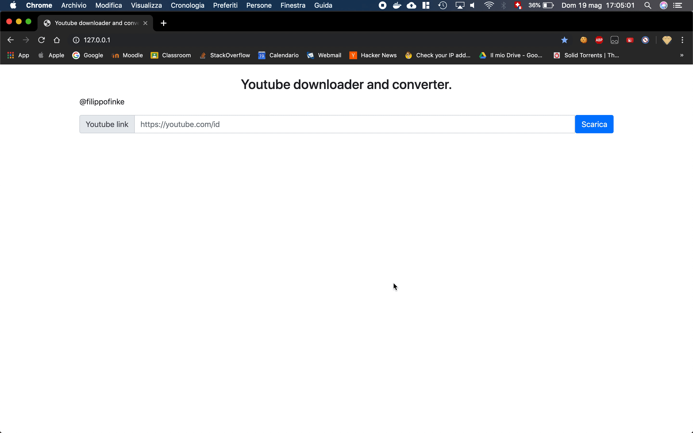

# Dependencies
> ffmpeg
```
brew install ffmpeg
```

# Setup

```
cd frontend
mkdir video
mkdir music
cd ..
cd backend
npm install
```
# Launch

```
cd frontend
php -S 127.0.0.1:80

cd backend
node .
```

# Demo



